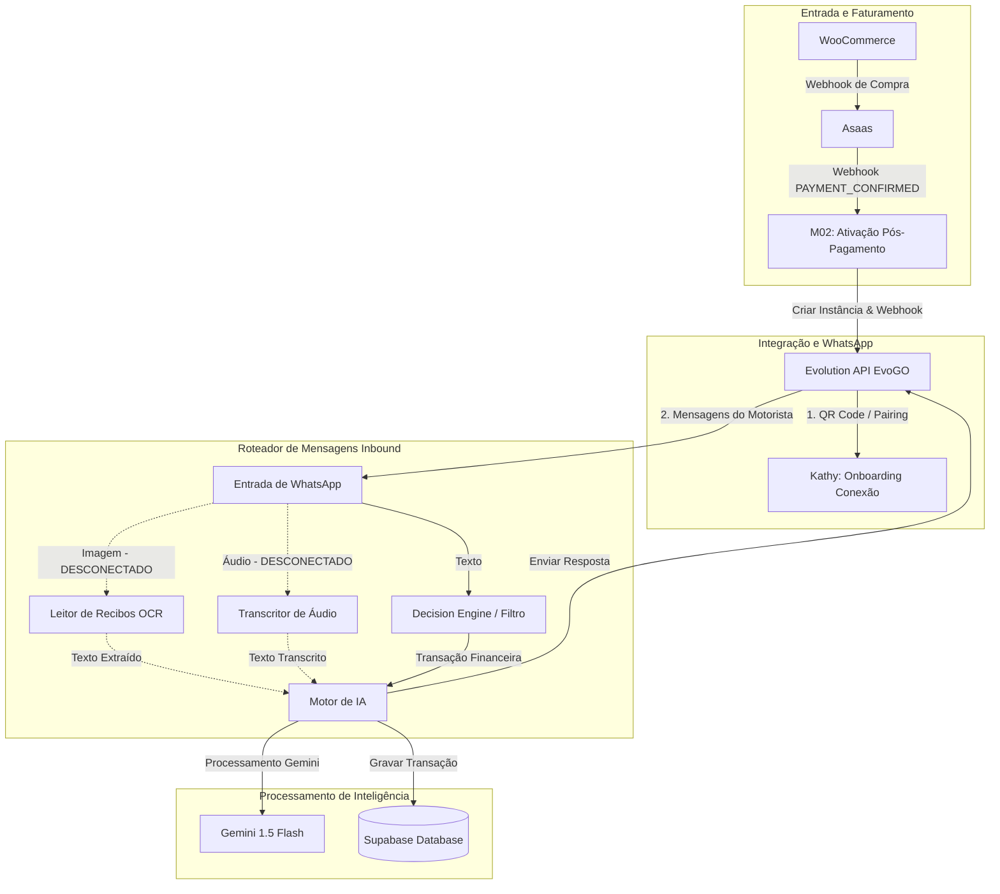

# 📌 Arquitetura Atual do ZapMonei
**Data da Auditoria:** 01 de Julho de 2026

> [!IMPORTANT]
> **Observação Regulatória de Auditoria**
> Este documento representa o estado atual do sistema. Nenhuma decisão de refatoração poderá ser tomada antes da conclusão desta auditoria. Toda simplificação deverá priorizar o reaproveitamento dos workflows existentes, evitando reescritas desnecessárias.

---

## 🗺️ Diagrama Geral da Arquitetura Atual

O fluxo de dados geral conecta os componentes principais desde a compra até o processamento de mensagens financeiras por IA e gravação no Supabase:

```
[ WooCommerce ] ──▶ [ Asaas ]
                         │
                         ▼
             [ Webhook PAYMENT_CONFIRMED ]
                         │
                         ▼
            [ M02: Ativação Pós-Pagamento ]
                         │
                         ▼
             [ Evolution API (EvoGO) ] ◀──▶ [ Onboarding (Kathy/Pairing) ]
                         │
                         ▼ (Mensagens do Usuário)
             [ Webhook whatsapp/inbound ]
                         │
                         ▼
             [ M01: Entrada de WhatsApp ]
                         │
        ┌────────────────┼────────────────┐
        │                │                │
     (Texto)          (Imagem)         (Áudio)
        │                │                │
        ▼                ▼ (Desconectado)  ▼ (Desconectado)
 [ Decision Engine ]  [ OCR Handler ]  [ Audio Transcriber ]
        │                │                │
        │                └───────┬────────┘
        ▼                        ▼
 [ M03: Motor de IA ] ◀──────────┘
        │
        ├──▶ [ Supabase Database ]
        │
        ▼ (Geração de Texto)
 [ Resposta WhatsApp (Kathy/Assistente) ]
```

### Diagrama em Formato Mermaid



---

## 🔄 Workflows n8n Detalhados

### 1. ZapMonei: Entrada de WhatsApp
*   **ID:** `67YPm1nKSktXwXGW`
*   **Objetivo:** Intercepta as mensagens recebidas da Evolution API e decide se desvia o usuário para o Onboarding ou se inicia o processamento da transação financeira pelo Motor de IA.
*   **Trigger:** Webhook (POST `/webhook/whatsapp/inbound`).
*   **Entrada:** Payload de mensagem da Evolution API contendo dados do remetente (`Sender`, `PushName`) e o tipo de mensagem (`Type`: `text`, `image`, `audio`).
*   **Fluxograma resumido:**
    ```
    Webhook (Entrada) 
           │
           ▼
    Switch: Roteador de Tipo (text / image / audio)
           │ (text)
           ▼
    Supabase: Buscar Usuário
           │
           ▼
    IF: Está em Onboarding? (onboarding_status != 'completed')
           ├── Sim: Mapeamento: Onboarding → Executar: Boas-vindas (Onboarding)
           └── Não: Supabase: Salvar Histórico (messages) → Executar: Motor de IA
    ```
*   **Todos os Nodes:**
    *   `Entrada do WhatsApp (Webhook)1` (n8n-nodes-base.webhook)
    *   `Switch: Roteador de Tipo1` (n8n-nodes-base.switch)
    *   `Supabase: Buscar Usuário1` (n8n-nodes-base.supabase)
    *   `IF: Está em Onboarding?1` (n8n-nodes-base.if)
    *   `Mapeamento: Onboarding (entrada WhatsApp)` (n8n-nodes-base.set)
    *   `Executar: Boas-vindas1` (n8n-nodes-base.executeWorkflow - chama `pWzC99a3p7rCkqLr`)
    *   `Supabase: Salvar Histórico1` (n8n-nodes-base.supabase)
    *   `Executar: Motor de IA1` (n8n-nodes-base.executeWorkflow - chama `XekB9YJ42IPtNg0Y`)
    *   *Nós Órfãos (Desconectados):* `Executar: OCR Handler` e `Executar: Transcritor de Áudio`
*   **APIs utilizadas:** Evolution API, Supabase.
*   **Banco:**
    *   Lê: `users`
    *   Grava: `messages`
*   **Dependências:**
    *   *Quem o chama:* Ninguém (gatilho externo).
    *   *Quem ele chama:* `pWzC99a3p7rCkqLr` (Onboarding do Usuário), `XekB9YJ42IPtNg0Y` (Motor de IA).
*   **Problemas conhecidos:**
    *   ⚠️ **Desconexão de Mídia:** As saídas `image` e `audio` do `Switch: Roteador de Tipo1` estão vazias e desconectadas. Os nós `Executar: OCR Handler` e `Executar: Transcritor de Áudio` estão órfãos no fluxo, impedindo o processamento de mensagens de voz e fotos.
*   **Oportunidades:**
    *   Reconectar as saídas do Switch de tipo aos respectivos sub-workflows.
*   **Prioridade:** 🔴 Crítico

---

### 2. ZapMonei: Onboarding do Usuário (Condicional Completo)
*   **ID:** `pWzC99a3p7rCkqLr` (ou `ZapMonei_ Onboarding do Usuário.json`)
*   **Objetivo:** Conduz a entrevista sequencial de cadastro via WhatsApp para personalização do assistente (nome, escopo, atividade e metas).
*   **Trigger:** Gatilho de Execução (Sub-workflow).
*   **Entrada:** Payload de contexto mapeado (`user_id`, `content` e `nome_user`).
*   **Fluxograma resumido:**
    ```
    Gatilho: Iniciar Onboarding
           │
           ▼
    Supabase: Buscar Status
           │
           ▼
    Switch: Etapa do Onboarding (avalia onboarding_step)
           ├── 0: Ask 0: Nome → Update 0 (step=1, status='agent_onboarding')
           ├── 1: Save 1: Name (salva nome, step=2) → Ask 1: Escopo
           ├── 2: Save 2: Scope (salva escopo, step=3) → Ask 2: Driver
           ├── 3: Save 3: Driver (salva se é motorista, step=4) → Ask 3: Platforms/Pain
           ├── 4: Save 4: Step (step=5) → Ask 4: Meta
           └── 5: Save 5: Finish (salva meta, status='completed') → Finish Message
    ```
*   **Todos os Nodes:**
    *   `Gatilho: Iniciar Onboarding` (n8n-nodes-base.executeWorkflowTrigger)
    *   `Supabase: Buscar Status` (n8n-nodes-base.supabase)
    *   `Switch: Etapa do Onboarding` (n8n-nodes-base.switch)
    *   `Ask 0: Nome`, `Ask 1: Escopo`, `Ask 2: Driver`, `Ask 3: Platforms/Pain`, `Ask 4: Meta` (n8n-nodes-base.httpRequest para `/send/text`)
    *   `Update 0`, `Save 1: Name`, `Save 2: Scope`, `Save 3: Driver`, `Save 4: Step`, `Save 5: Finish` (n8n-nodes-base.supabase)
    *   `Finish Message` (n8n-nodes-base.httpRequest para `/send/text`)
*   **APIs utilizadas:** Evolution API, Supabase.
*   **Banco:**
    *   Lê: `users`
    *   Grava/Atualiza: `users` (colunas: `onboarding_step`, `onboarding_status`, `agent_custom_name`, `control_type`, `is_driver`, `monthly_goal`)
*   **Dependências:**
    *   *Quem o chama:* `67YPm1nKSktXwXGW` (ZapMonei: Entrada de WhatsApp).
    *   *Quem ele chama:* Nenhum.
*   **Problemas conhecidos:**
    *   Falta de resiliência a mensagens inválidas. Se o usuário responder a uma pergunta com dados fora do esperado, o sistema salva o valor bruto e avança o passo de qualquer maneira.
    *   `whatsapp_instance_token` e `whatsapp_number` lidos do banco são usados sem tratamento prévio nas chamadas de envio.
*   **Oportunidades:**
    *   Simplificar e centralizar a máquina de estados, reduzindo o número de chamadas redundantes ao Supabase.
*   **Prioridade:** 🟡 Importante

---

### 3. ZapMonei_Onboarding_Kathy
*   **ID:** `j3eyLr3P8yhJtslL`
*   **Objetivo:** Guia o usuário na conexão de seu WhatsApp enviando um tutorial interativo de fotos e gerando o QR Code ou código de pareamento.
*   **Trigger:** Webhook (POST `/webhook/kathy-onboarding`).
*   **Entrada:** Resposta do WhatsApp do motorista indicando opção 1 (Pareamento por Código) ou 2 (QR Code).
*   **Fluxograma resumido:**
    ```
    Webhook Kathy ──▶ Supabase: Buscar Usuário ──▶ Opção 1 ou 2?
                                                    ├── 1: Tutorial Visto? (Código)
                                                    │      ├── Sim: Kathy: Curto Código → Evo-Go: Gerar Pairing → Kathy: Enviar Código Real...
                                                    │      └── Não: Tutoriais 1-3 → Tutorial Code: Passo 4-Final → Supabase: Marcar Visto...
                                                    └── 2: Tutorial Visto? (QR)
                                                           ├── Sim: Kathy: Curto QR → Evo-Go: Gerar QR Code → Kathy: Enviar QR Code Real...
                                                           └── Não: Tutoriais 1-3 → Tutorial QR: Final → Supabase: Marcar Visto...
                                                                                                                   │
                                                                   ┌───────────────────────────────────────────────┘
                                                                   ▼
                                                             Loop Contador ──▶ Wait 10s ──▶ Check Status ──▶ Conectou?
                                                                   ▲                                            ├── Sim: Kathy: Sucesso!
                                                                   └────────────────── Não (tentativas < 30) ───┘
                                                                                                                └── Não (expirou): Kathy: Timeout
    ```
*   **Todos os Nodes:**
    *   `Webhook Kathy` (n8n-nodes-base.webhook)
    *   `Supabase: Buscar Usuário` (n8n-nodes-base.supabase)
    *   `Opção 1 ou 2?` (n8n-nodes-base.switch)
    *   `Tutorial Visto? (Código)` & `Tutorial Visto? (QR)` (n8n-nodes-base.if)
    *   `Tutorial 1` a `3`, `Tutorial QR: Final`, `Tutorial Code: Passo 4`, `Tutorial Code: Final` (n8n-nodes-base.httpRequest para `/send/media`)
    *   `Wait 1s`, `Wait 1s B`, `Wait 1s C`, `Wait 10s Loop` (n8n-nodes-base.wait)
    *   `Supabase: Marcar Visto` (n8n-nodes-base.supabase)
    *   `Evo-Go: Gerar QR Code` (`/instance/qr`) & `Evo-Go: Gerar Pairing` (`/instance/pair`)
    *   `Kathy: Enviar QR Code Real` & `Kathy: Enviar Código Real` (n8n-nodes-base.httpRequest)
    *   `Loop Contador` (n8n-nodes-base.set)
    *   `Check Connection Status` (`/instance/status`)
    *   `Conectou?` (n8n-nodes-base.if)
    *   `Kathy: Sucesso!` (n8n-nodes-base.httpRequest para `/send/text`)
    *   `Ainda no tempo?` (n8n-nodes-base.if)
    *   `Kathy: Timeout` (n8n-nodes-base.httpRequest)
    *   `Kathy: Curto QR` & `Kathy: Curto Código` (n8n-nodes-base.httpRequest)
*   **APIs utilizadas:** Evolution API, Supabase.
*   **Banco:**
    *   Lê: `users`
    *   Grava/Atualiza: `users` (`tutorial_visto` = true)
*   **Dependências:**
    *   *Quem o chama:* Resposta do usuário à ativação pós-pagamento (`hny1Z8BTMqvcwlWR`).
    *   *Quem ele chama:* Nenhum.
*   **Problemas conhecidos:**
    *   ⚠️ **Risco de Bloqueio por Polling (Wait Loop):** O loop de verificação de conexão executa até 30 iterações com `Wait` de 10s. Isso consome recursos de CPU do n8n de forma síncrona por até 5 minutos por usuário, gerando concorrência severa sob alta carga.
    *   Token de autenticação fixo: `73d46179-2a3c-44b8-834c-146ef526474e`.
    *   URLs de imagens de mídia de tutorial hospedadas em domínio externo fixo.
*   **Oportunidades:**
    *   Substituir o loop síncrono por uma escuta passiva de webhook enviada pela Evolution API no evento `CONNECTION`.
*   **Prioridade:** 🔴 Crítico

---

### 4. ZapMonei: Motor de Inteligência Artificial
*   **ID:** `XekB9YJ42IPtNg0Y`
*   **Objetivo:** Processa e classifica a mensagem financeira enviada pelo usuário, gerando a transação no banco e respondendo via WhatsApp.
*   **Trigger:** Gatilho de Execução (Sub-workflow).
*   **Entrada:** Payload contendo `user_id` e `content` (texto da mensagem ou texto do OCR).
*   **Fluxograma resumido:**
    ```
    Gatilho da IA ──▶ Buscar Contexto do Usuário (users) ──▶ Análise Financeira (Gemini Agent) 
                                                                    │
    HTTP Request1 (WhatsApp) ◀── Gravar Transação (transactions) ◀── Processar Resposta (Code JSON parser)
    ```
*   **Todos os Nodes:**
    *   `Gatilho da IA` (n8n-nodes-base.executeWorkflowTrigger)
    *   `Buscar Contexto do Usuário` (n8n-nodes-base.supabase)
    *   `Cérebro Gemini` (@n8n/n8n-nodes-langchain.lmChatGoogleGemini)
    *   `Análise Financeira (IA)` (@n8n/n8n-nodes-langchain.agent)
    *   `Processar Resposta da IA` (n8n-nodes-base.code - parser JS)
    *   `Gravar Transação no Banco` (n8n-nodes-base.supabase)
    *   `HTTP Request1` (n8n-nodes-base.httpRequest para `/send/text`)
    *   *Nó órfão:* `HTTP Request` (exemplos de testes desconectados)
*   **APIs utilizadas:** Gemini API, Evolution API, Supabase.
*   **Banco:**
    *   Lê: `users`
    *   Grava: `transactions`
*   **Dependências:**
    *   *Quem o chama:* `67YPm1nKSktXwXGW` (Entrada de WhatsApp), `KAes31apBR0uuIBh` (OCR Handler).
    *   *Quem ele chama:* Nenhum.
*   **Problemas conhecidos:**
    *   ⚠️ **Transações de Erro no Banco:** Se a IA falhar em retornar um JSON estrito, o parser captura a exceção e grava uma transação com valor zero, tipo `"erro"` e descrição `"Erro no Parser"`. Isso insere lixo no banco de dados.
    *   Apikey hardcoded no nó de resposta: `ad2a5486-0c42-482b-be88-be2e38d82945`.
*   **Oportunidades:**
    *   Ativar o modo estruturado do Gemini (Structured Output) ou schemas de validação de JSON.
    *   Evitar gravação de transações de erro no banco.
*   **Prioridade:** 🔴 Crítico

---

### 5. ZapMonei: Leitor de Recibos (OCR) - Versão Estável
*   **ID:** `KAes31apBR0uuIBh`
*   **Objetivo:** Analisa imagem de recibos por meio do Gemini Vision, extrai os parâmetros estruturados e despacha o texto formatado para o Motor de IA.
*   **Trigger:** Gatilho de Execução (Sub-workflow).
*   **Entrada:** Imagem/mídia.
*   **Fluxograma resumido:**
    ```
    Entrada: Foto Manual ──▶ IA: Analisador de Recibo (Gemini Vision)
                                           │
    Pulo: Enviar ao Motor (Motor de IA) ◀── Código: Tradutor JSON (Code JS)
    ```
*   **Todos os Nodes:**
    *   `Entrada: Foto Manual` (n8n-nodes-base.executeWorkflowTrigger)
    *   `CCerebro: Visao de Gemeos` (@n8n/n8n-nodes-langchain.lmChatGoogleGemini)
    *   `IA: Analisador de Recibo` (@n8n/n8n-nodes-langchain.agent)
    *   `Código: Tradutor JSON` (n8n-nodes-base.code)
    *   `Pulo: Enviar ao Motor` (n8n-nodes-base.executeWorkflow - chama `XekB9YJ42IPtNg0Y`)
*   **APIs utilizadas:** Gemini API (Vision), Supabase (via Motor).
*   **Banco:** Nenhum diretamente.
*   **Dependências:**
    *   *Quem o chama:* Supostamente `67YPm1nKSktXwXGW` (Entrada de WhatsApp - desconectado).
    *   *Quem ele chama:* `XekB9YJ42IPtNg0Y` (Motor de IA).
*   **Problemas conhecidos:**
    *   ⚠️ **Fluxo Inativo na Entrada:** Devido ao nó desconectado no fluxo de Entrada de WhatsApp, este workflow de OCR nunca é executado em produção automaticamente ao receber imagens.
    *   Não realiza upload de comprovantes no Supabase Storage ou registro formal na tabela `attachments` deste fluxo de triagem.
*   **Oportunidades:**
    *   Reatar o acoplamento com a Entrada de WhatsApp e registrar os anexos corretamente no banco.
*   **Prioridade:** 🔴 Crítico

---

### 6. ZapMonei: Transcritor de Áudio
*   **ID:** `5NwgAaUFTrAtFfkN`
*   **Objetivo:** Faz download de áudios do WhatsApp usando a API da Evolution e transcreve a mensagem via Gemini Flash.
*   **Trigger:** Gatilho de Execução (Sub-workflow).
*   **Entrada:** Metadata de áudio (`instance`, `messageId`).
*   **Fluxograma resumido:**
    ```
    Trigger ──▶ HTTP Request (Evolution API /getBase64FromMessage) ──▶ IA: Transcrever (Gemini) ──▶ Código: Formatar
    ```
*   **Todos os Nodes:**
    *   `Execute Workflow Trigger` (n8n-nodes-base.executeWorkflowTrigger)
    *   `HTTP Request` (n8n-nodes-base.httpRequest)
    *   `Cérebro: Gemini Flash` (@n8n/n8n-nodes-langchain.lmChatGoogleGemini)
    *   `IA: Transcrever Áudio` (@n8n/n8n-nodes-langchain.agent)
    *   `Código: Formatar Saída` (n8n-nodes-base.code)
*   **APIs utilizadas:** Evolution API, Gemini API.
*   **Banco:** Nenhum diretamente.
*   **Dependências:**
    *   *Quem o chama:* Supostamente `67YPm1nKSktXwXGW` (Entrada de WhatsApp - desconectado).
    *   *Quem ele chama:* Nenhum (apenas retorna a transcrição textual).
*   **Problemas conhecidos:**
    *   ⚠️ **Inutilidade no Fluxo de Ingestão:** Está desconectado do fluxo de entrada de WhatsApp e, quando retorna a transcrição, ela não é enviada para o Motor de IA, morrendo como uma simples formatação de string.
    *   Token hardcoded: `0326ad2f6fcc4cb57e1e132812b1e1e1`.
*   **Oportunidades:**
    *   Ligar a saída deste workflow como entrada de texto do Motor de IA para consolidar transcrições de voz como transações reais.
*   **Prioridade:** 🔴 Crítico

---

### 7. ZapMonei: Proactive Nudge
*   **ID:** `zQxxcCL7pgUrdUD7`
*   **Objetivo:** Identifica usuários ativos e gera lembretes automáticos de inatividade via IA a cada hora.
*   **Trigger:** Gatilho por Horário (a cada 1 hora).
*   **Entrada:** Nenhuma.
*   **Fluxograma resumido:**
    ```
    Schedule Trigger (1h) ──▶ Get Active Users (users) ──▶ Get Last Message (messages)
                                                                 │
    Send Nudge WA (HTTP) ◀── Nudge Generator (Gemini Agent) ◀────┘
    ```
*   **Todos os Nodes:**
    *   `Schedule Trigger` (n8n-nodes-base.scheduleTrigger)
    *   `Get Active Users` (n8n-nodes-base.supabase)
    *   `Get Last Message` (n8n-nodes-base.supabase)
    *   `Lm Chat Google Gemini` (@n8n/n8n-nodes-langchain.lmChatGoogleGemini)
    *   `Nudge Generator` (@n8n/n8n-nodes-langchain.agent)
    *   `Send Nudge WA` (n8n-nodes-base.httpRequest para `/message/sendText`)
*   **APIs utilizadas:** Gemini API, Evolution API, Supabase.
*   **Banco:**
    *   Lê: `users`, `messages`.
*   **Dependências:**
    *   *Quem o chama:* Gatilho temporal nativo do n8n.
    *   *Quem ele chama:* Nenhum.
*   **Problemas conhecidos:**
    *   ⚠️ **Desativado:** Encontra-se marcado como inativo (`active: false`) nas configurações globais.
    *   **Incompatibilidade de Nome de Campo:** Tenta enviar usando `whatsapp_instance` do usuário, mas o campo correto de gravação no Supabase é `whatsapp_instance_name`.
    *   **Desperdício de Tokens:** O nó `Get Last Message` retorna todas as mensagens de histórico sem limitação estruturada de tempo de inatividade, confiando a lógica puramente ao prompt do Agente Gemini.
*   **Oportunidades:**
    *   Ativar o fluxo e readequar a consulta do banco de dados para filtrar no SQL apenas usuários que não tenham mensagens nos últimos 60 minutos.
*   **Prioridade:** 🟢 Auxiliar

---

### 8. ZapMonei: Ativação Pós-Pagamento (Completo)
*   **ID:** `hny1Z8BTMqvcwlWR`
*   **Objetivo:** Cria usuário, provisiona instância e vincula webhook automaticamente após notificação de pagamento.
*   **Trigger:** Webhook (POST `/webhook/asaas-payment-webhook`).
*   **Entrada:** Payload de compra do WooCommerce/Asaas.
*   **Fluxograma resumido:**
    ```
    Webhook: Pagamento ──▶ Supabase: Criar/Atualizar Usuário (users)
                                      │
    Supabase: Salvar Token ◀── Evo-Go: Criar Instância (HTTP)
           │
    EvoGo: Configurar Webhook (HTTP) ──▶ Kathy: Boas-Vindas (HTTP)
    ```
*   **Todos os Nodes:**
    *   `Webhook: Pagamento Recebido` (n8n-nodes-base.webhook)
    *   `Supabase: Criar/Atualizar Usuário` (n8n-nodes-base.supabase)
    *   `Evo-Go: Criar Instância` (n8n-nodes-base.httpRequest)
    *   `Supabase: Salvar Token` (n8n-nodes-base.supabase)
    *   `EvoGo: Configurar Webhook` (n8n-nodes-base.httpRequest)
    *   `Kathy: Boas-Vindas` (n8n-nodes-base.httpRequest)
*   **APIs utilizadas:** Evolution API, Supabase.
*   **Banco:**
    *   Grava/Atualiza: `users` (colunas: `nome`, `whatsapp_number`, `plan`, `onboarding_status`, `whatsapp_instance_token`, `whatsapp_instance_name`)
*   **Dependências:**
    *   *Quem o chama:* WooCommerce/Asaas (Externo).
    *   *Quem ele chama:* `j3eyLr3P8yhJtslL` (indiretamente, pela interação do usuário).
*   **Problemas conhecidos:**
    *   ⚠️ **Incompatibilidade de Payload:** Nome do webhook indica Asaas, mas a extração do JSON é mapeada em campos específicos do WooCommerce (`body.billing.first_name`, `body.line_items[0].name`). Disparos diretos do Asaas falharão por falta dessas chaves.
    *   Token hardcoded na chamada de boas-vindas: `89e50abb-43db-4b99-ab45-3018e65430b5`.
*   **Oportunidades:**
    *   Modularizar a validação e o roteamento de gateways de pagamento para aceitar tanto WooCommerce quanto Asaas de forma nativa.
*   **Prioridade:** 🔴 Crítico

---

## 🔌 12. Webhooks

Abaixo está o inventário de webhooks configurados no ecossistema atual do ZapMonei:

| Origem | Endpoint | Workflow Associado | Resposta Esperada | Status |
| :--- | :--- | :--- | :--- | :--- |
| WooCommerce / Asaas | `/webhook/asaas-payment-webhook` | `ZapMonei: Ativação Pós-Pagamento (Completo)` | Respond Immediately (`Workflow got started.`) | Ativo |
| Evolution API (Mensagem) | `/webhook/whatsapp/inbound` | `ZapMonei: Entrada de WhatsApp` | Respond Immediately (`Workflow got started.`) | Ativo |
| Evolution API (Onboarding) | `/webhook/kathy-onboarding` | `ZapMonei_Onboarding_Kathy` | Último nó do fluxo (Mensagem/Código/QR Code) | Ativo |

---

## 🔑 13. Variáveis de Ambiente

As seguintes variáveis de ambiente são utilizadas e distribuídas no ecossistema (atualmente espalhadas em credenciais do n8n, cabeçalhos de nós HTTP e configurações de rede):

*   **`GEMINI_API_KEY`:** Chave de acesso do Google AI Studio para os modelos `gemini-1.5-flash` usados nos nós do LangChain.
*   **`ASAAS_TOKEN`:** Token de autorização para chamadas e consultas à API do Asaas.
*   **`ASAAS_WEBHOOK_SECRET`:** Segredo criptográfico para autenticação e integridade do webhook de pagamento.
*   **`EVOLUTION_URL`:** URL base do servidor da Evolution API (EvoGO) (ex: `https://apigo.euattendo.com.br`).
*   **`EVOLUTION_API_KEY`:** Token de autorização geral do administrador da Evolution API (espalhado e hardcoded em vários nós HTTP do n8n como `apikey`).
*   **`SUPABASE_URL`:** URL da API do projeto Supabase.
*   **`SUPABASE_KEY`:** Service role key ou anon key do banco de dados (armazenada em credenciais do n8n).
*   **`WOOCOMMERCE_KEY`:** Consumer Key do WooCommerce para autenticação de requisições de vendas.
*   **`WOOCOMMERCE_SECRET`:** Consumer Secret do WooCommerce para autenticação.
*   **`SLACK_WEBHOOK`:** URL de entrada do Slack para disparo de alertas de logs e falhas críticas.

---

## 📊 14. Matriz de Reutilização

*Esta matriz deve ser preenchida pelo usuário após a conclusão da auditoria.*

| Workflow | Manter | Ajustar | Eliminar |
| :--- | :--- | :--- | :--- |
| Entrada WhatsApp | | | |
| Motor Financeiro | | | |
| OCR | | | |
| Kathy | | | |
| Pairing | | | |
| Onboarding | | | |
| IA Geral | | | |

---

## 🚀 15. Fluxos Críticos (End-to-End)

Abaixo estão descritos os fluxos completos que representam a jornada do usuário no ZapMonei:

### Fluxo 1 - Compra → Ativação
*   **Workflow(s) envolvidos:** `ZapMonei: Ativação Pós-Pagamento (Completo)` (`hny1Z8BTMqvcwlWR`).
*   **Ordem de execução:**
    1. Usuário realiza compra no **WooCommerce**.
    2. Cobrança é liquidada via **Asaas**.
    3. Asaas dispara webhook para `/webhook/asaas-payment-webhook` no n8n.
    4. Workflow de Ativação cria usuário no **Supabase** com status `pending`.
    5. Workflow realiza chamada HTTP para a **Evolution API** para criar uma nova instância dedicada ao usuário.
    6. Atualiza registro do usuário no banco com o token e nome da instância gerada.
    7. Configura a instância do WhatsApp para bater de volta no webhook de inbound (`/webhook/whatsapp/inbound`).
    8. Envia mensagem de boas-vindas da Kathy contendo as opções de conexão (QR Code ou Pareamento por Código).
*   **APIs chamadas:** Evolution API (`/instance/create`, `/instance/connect`, `/send/text`), Supabase.
*   **Banco utilizado:** `public.users` (criação e atualização de registro).
*   **Pontos de falha conhecidos:**
    *   Se a estrutura de webhook do gateway mudar, a extração de dados do WooCommerce (`billing.first_name`) quebrará e o usuário não será criado.
    *   Timeout na criação de instâncias no Evolution API pode deixar o status do usuário travado em `pending`.

### Fluxo 2 - Primeira Conexão
*   **Workflow(s) envolvidos:** `ZapMonei_Onboarding_Kathy` (`j3eyLr3P8yhJtslL`).
*   **Ordem de execução:**
    1. O usuário responde a mensagem inicial indicando opção 1 (Código) ou 2 (QR Code).
    2. O webhook `/webhook/kathy-onboarding` é ativado.
    3. Verifica se o tutorial já foi visto; caso contrário, envia as imagens sequenciais de instrução.
    4. Dispara a chamada para gerar o código de pareamento (`/instance/pair`) ou QR Code (`/instance/qr`) da **Evolution API** e exibe ao usuário.
    5. Inicia o loop de verificação fazendo polling a cada 10 segundos no status da conexão.
    6. Quando o status retorna `connected: true`, marca `tutorial_visto: true` no banco.
    7. Envia mensagem de parabéns convidando-o a registrar seu primeiro lançamento financeiro.
*   **APIs chamadas:** Evolution API (`/instance/qr`, `/instance/pair`, `/send/media`, `/send/text`, `/instance/status`), Supabase.
*   **Banco utilizado:** `public.users` (leitura e atualização de flag `tutorial_visto`).
*   **Pontos de falha conhecidos:**
    *   Excesso de conexões no n8n devido ao loop síncrono com `Wait` de 10s.
    *   O QR Code expira no celular do usuário antes do fim das 30 tentativas, deixando a mensagem de timeout confusa.

### Fluxo 3 - Registro Financeiro
*   **Workflow(s) envolvidos:** `ZapMonei: Entrada de WhatsApp` (`67YPm1nKSktXwXGW`) ──▶ `ZapMonei: Motor de Inteligência Artificial` (`XekB9YJ42IPtNg0Y`).
*   **Ordem de execução:**
    1. O usuário envia uma mensagem de texto (ex: "Paguei R$ 50 de gasolina") no WhatsApp.
    2. Webhook da **Evolution API** dispara para o n8n no endpoint `/webhook/whatsapp/inbound`.
    3. O workflow de Entrada valida o usuário e o desvia para o Motor de IA se o onboarding já estiver concluído.
    4. Salva a mensagem recebida na tabela `messages`.
    5. Chama o Motor de IA repassando o ID do usuário e conteúdo do texto.
    6. O Motor busca os metadados do usuário para contexto.
    7. Envia o texto da mensagem ao **Gemini 1.5 Flash** para extração estruturada de campos (tipo, valor, categoria, descrição).
    8. O parser JavaScript processa a saída JSON.
    9. Grava o lançamento financeiro na tabela `transactions`.
    10. Envia a resposta de confirmação e comemoração gerada pela IA ao motorista.
*   **APIs chamadas:** Gemini API (LangChain Agent), Evolution API (`/send/text`), Supabase.
*   **Banco utilizado:** `public.users` (leitura), `public.messages` (gravação), `public.transactions` (gravação).
*   **Pontos de falha conhecidos:**
    *   Falha de formatação/JSON da IA resulta na gravação de um lançamento com tipo `"erro"` e valor zero.
    *   O motor não lida com mensagens de voz ou imagem devido à desconexão dos fluxos de OCR e Transcritor de Áudio na Entrada.

### Fluxo 4 - Consulta
*   **Workflow(s) envolvidos:** `ZapMonei: Entrada de WhatsApp` (`67YPm1nKSktXwXGW`) ──▶ `ZapMonei: Motor de Inteligência Artificial` (`XekB9YJ42IPtNg0Y`).
*   *(Nota: O Decision Engine completo de consultas SQL mapeado na documentação de design ainda não está totalmente implementado nos workflows n8n existentes. Atualmente, o Motor de IA tenta processar qualquer mensagem via modelo de linguagem genérico).*
*   **Ordem de execução:**
    1. O usuário envia uma pergunta sobre seu saldo (ex: "Quanto eu gastei hoje?").
    2. A mensagem atinge o endpoint `/webhook/whatsapp/inbound`.
    3. Entrada de WhatsApp salva a mensagem em `messages` e repassa para o Motor de IA.
    4. O Gemini recebe a pergunta e, como não há um roteamento de consulta estruturado ativo ou ferramentas de Text-to-SQL ligadas, ele tenta adivinhar ou responder com base no que conhece (gerando alucinações matemáticas ou respondendo que não sabe consultar).
*   **APIs chamadas:** Gemini API, Evolution API.
*   **Banco utilizado:** `public.users` (leitura), `public.messages` (gravação).
*   **Pontos de falha conhecidos:**
    *   Ausência de conexão com o banco para realizar operações de leitura/agregação de dados financeiros históricos (falta do fluxo Nível 3 de Decision Engine).
