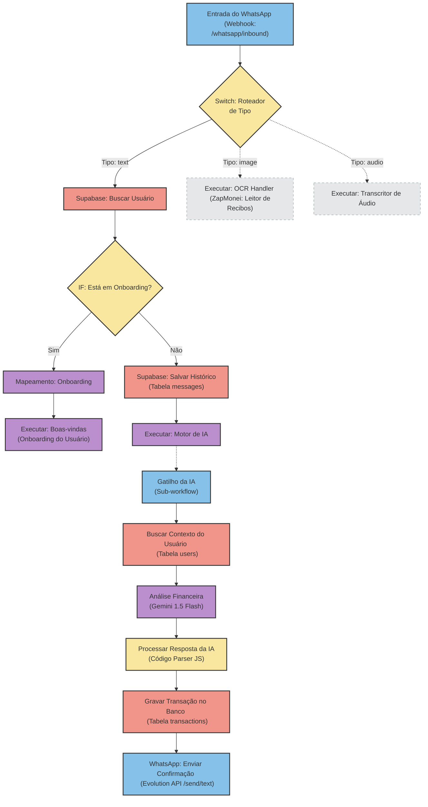

# Auditoria Técnica - Workflow M01 (Receber Mensagens do WhatsApp)
**Data da Auditoria:** 01 de Julho de 2026

Este documento apresenta o levantamento técnico detalhado do workflow responsável por receber, triar, processar e responder às mensagens dos usuários via WhatsApp no ZapMonei. A análise reflete exatamente o estado atual de implementação no orquestrador n8n, sem proposição ou execução de alterações no código.

---

## 1. Identificação dos Workflows Relacionados

O recebimento de mensagens é um fluxo composto, orquestrado principalmente pelo workflow de Entrada de WhatsApp, que delega tarefas para sub-workflows de acordo com o tipo de mídia e o status do usuário:

*   **Workflow Principal:** `ZapMonei: Entrada de WhatsApp` (ID: `67YPm1nKSktXwXGW`)
*   **Sub-Workflow IA:** `ZapMonei: Motor de Inteligência Artificial` (ID: `XekB9YJ42IPtNg0Y`)
*   **Sub-Workflow OCR:** `ZapMonei: Leitor de Recibos (OCR) - Versão Estável` (ID: `KAes31apBR0uuIBh`)
*   **Sub-Workflow Áudio:** `ZapMonei: Transcritor de Áudio` (ID: `5NwgAaUFTrAtFfkN`)

---

## 2. Trigger (Webhook Evolution API)

O fluxo principal é iniciado passivamente por um webhook ativado na Evolution API (EvoGO) quando uma nova mensagem é recebida no WhatsApp do motorista:

*   **Nome do Nó no n8n:** `Entrada do WhatsApp (Webhook)1`
*   **Tipo do Nó:** `n8n-nodes-base.webhook` (Versão 2.1)
*   **Método HTTP:** `POST`
*   **Caminho do Endpoint (Inbound):** `whatsapp/inbound`
*   **Response Mode:** Respond Immediately (`"Workflow got started."`)
*   **URL de Produção:** `https://<n8n-domain>/webhook/whatsapp/inbound`
*   **URL de Teste:** `https://<n8n-domain>/webhook-test/whatsapp/inbound`

---

## 3. Payload Recebido

O payload recebido no Webhook é gerado pela Evolution API sob a seguinte estrutura JSON:

```json
{
  "event": "Message",
  "data": {
    "Info": {
      "Chat": "5516982265352@s.whatsapp.net",
      "Sender": "5516982265352:4@s.whatsapp.net",
      "SenderAlt": "1234567890@lid",
      "IsFromMe": false,
      "IsGroup": false,
      "ID": "3EB0C05FF2D3A0068B2A2D",
      "Type": "text",
      "PushName": "Nome do Usuário",
      "Timestamp": "2026-07-01T10:56:58-03:00",
      "MediaType": ""
    },
    "Message": {
      "conversation": "Paguei R$ 50 de gasolina hoje"
    },
    "IsEphemeral": false,
    "IsViewOnce": false,
    "IsEdit": false
  },
  "instanceId": "724c4f49-de4f-4e93-b76a-cb2a538cabd5",
  "instanceToken": "ad2a5486-0c42-482b-be88-be2e38d82945"
}
```

### Campos Mapeados e Extraídos:
*   `body.data.Info.Type`: Define o tipo de mensagem recebida (`"text"`, `"image"`, `"audio"`).
*   `body.data.Info.Sender` e `body.data.Info.RecipientAlt`: Utilizados para extrair o número de WhatsApp do remetente (removendo o sufixo `@s.whatsapp.net`).
*   `body.data.Message.conversation` ou `body.data.Message.extendedTextMessage.text`: Contém o texto enviado pelo usuário.
*   `body.data.Message.extendedTextMessage.caption`: Legenda que acompanha imagens (quando aplicável).
*   `body.data.Info.PushName`: Nome de exibição configurado no perfil do WhatsApp do usuário.

---

## 4. Ordem de Execução e Nós do Workflow

### 4.1. Workflow Principal: `ZapMonei: Entrada de WhatsApp`

1.  **`Entrada do WhatsApp (Webhook)1`** (Gatilho): Recebe o payload HTTP POST da Evolution API.
2.  **`Switch: Roteador de Tipo1`**: Avalia o tipo de mensagem (`Type`).
    *   **Se `text`:** Segue para o nó `Supabase: Buscar Usuário1`.
    *   **Se `image`:** Direciona para a Saída 1 (**DESCONECTADA** na produção).
    *   **Se `audio`:** Direciona para a Saída 2 (**DESCONECTADA** na produção).
3.  **`Supabase: Buscar Usuário1`**: Consulta o banco de dados Supabase na tabela `users` buscando o número do WhatsApp.
4.  **`IF: Está em Onboarding?1`**: Verifica o status do cadastro do usuário.
    *   **Se `onboarding_status != 'completed'` (Verdadeiro):**
        5a. **`Mapeamento: Onboarding (entrada WhatsApp)`**: Formata e limpa os campos de entrada do onboarding.
        6a. **`Executar: Boas-vindas1`**: Executa o sub-workflow de Onboarding (`ZapMonei: Onboarding do Usuário (Condicional Completo)`).
    *   **Se `onboarding_status == 'completed'` (Falso):**
        5b. **`Supabase: Salvar Histórico1`**: Insere a mensagem no histórico (`messages`).
        6b. **`Executar: Motor de IA1`**: Executa o sub-workflow `ZapMonei: Motor de Inteligência Artificial`.

---

### 4.2. Sub-Workflow: `ZapMonei: Motor de Inteligência Artificial`

1.  **`Gatilho da IA`** (Gatilho): Recebe os dados de entrada (`user_id`, `content`).
2.  **`Buscar Contexto do Usuário`** (Supabase): Lê os dados cadastrais (ex: nome, whatsapp_number) do usuário na tabela `users`.
3.  **`Análise Financeira (IA)`** (LangChain Agent): Conecta-se ao modelo **Gemini 1.5 Flash** (via nó `Cérebro Gemini`) para extrair as variáveis financeiras em formato JSON.
4.  **`Processar Resposta da IA`** (Code): Executa um script em JavaScript para limpar e analisar a resposta JSON gerada pela inteligência artificial.
5.  **`Gravar Transação no Banco`** (Supabase): Insere o lançamento financeiro na tabela `transactions`.
6.  **`HTTP Request1`** (HTTP): Dispara a resposta estruturada via Evolution API de volta para o WhatsApp do usuário.

---

### 4.3. Sub-Workflow: `ZapMonei: Leitor de Recibos (OCR) - Versão Estável` (Órfão/Inativo)

1.  **`Entrada: Foto Manual`** (Gatilho): Aguarda dados de imagem.
2.  **`IA: Analisador de Recibo`** (LangChain Agent): Conecta-se ao **Gemini 1.5 Flash** (via nó `CCerebro: Visao de Gemeos`) e analisa visualmente a imagem do recibo.
3.  **`Código: Tradutor JSON`** (Code): Analisa a resposta em formato texto e realiza o parser para JSON.
4.  **`Pulo: Enviar ao Motor`** (Execute Workflow): Dispara o workflow do `Motor de IA` passando o texto/dados interpretados.

---

### 4.4. Sub-Workflow: `ZapMonei: Transcritor de Áudio` (Órfão/Inativo)

1.  **`Execute Workflow Trigger`** (Gatilho): Recebe metadados de áudio do WhatsApp.
2.  **`HTTP Request`** (HTTP): Faz o download do arquivo de áudio codificado em Base64 através da Evolution API.
3.  **`IA: Transcrever Áudio`** (LangChain Agent): Utiliza o **Gemini 1.5 Flash** (via nó `Cérebro: Gemini Flash`) para transcrever o conteúdo do áudio.
4.  **`Código: Formatar Saída`** (Code): Formata a string de texto transcrita. (Nota: A saída morre neste nó, sem nenhuma chamada subsequente).

---

## 5. Todos os IFs e Switches

### 5.1. Switches
*   **`Switch: Roteador de Tipo1`** (em `ZapMonei: Entrada de WhatsApp`):
    *   **Expressão avaliada:** `{{ $json.body.data.Info.Type }}`
    *   **Saída 1 (text):** Encaminha para o fluxo de busca de perfil.
    *   **Saída 2 (image):** Sem conexões de saída (Desconectado).
    *   **Saída 3 (audio):** Sem conexões de saída (Desconectado).

### 5.2. IFs
*   **`IF: Está em Onboarding?1`** (em `ZapMonei: Entrada de WhatsApp`):
    *   **Condição:** `{{ $json.onboarding_status }}` (String) `notEquals` `completed`.
    *   **Resultado True (Sim):** Executa o Onboarding.
    *   **Resultado False (Não):** Salva o histórico de chat e executa o Motor de IA.

---

## 6. Chamadas Gemini, OCR e Whisper

*   **Chamadas Gemini:**
    *   **Workflow Motor de IA:** O nó `Análise Financeira (IA)` utiliza o Gemini 1.5 Flash para extrair os metadados financeiros da mensagem e gerar a resposta amigável em formato JSON.
    *   **Workflow OCR:** O nó `IA: Analisador de Recibo` utiliza a capacidade multimodal do Gemini 1.5 Flash para ler a imagem e extrair os dados textuais em formato JSON.
    *   **Workflow de Áudio:** O nó `IA: Transcrever Áudio` utiliza o Gemini 1.5 Flash para transcrever e interpretar mensagens de voz.
*   **Chamadas OCR Dedicadas:** Não existem. A leitura visual de recibos e comprovantes é realizada **diretamente pelas capacidades multimodais do Gemini 1.5 Flash (Vision)**.
*   **Chamadas Whisper:** Não existem. A transcrição de arquivos de áudio é realizada **diretamente pelo Gemini 1.5 Flash (Audio/Text)**.

---

## 7. Chamadas Supabase (Tabelas Lidas e Gravadas)

O workflow interage com o banco de dados Supabase através de nós nativos de integração:

| Workflow | Nó | Tabela | Operação | Finalidade |
| :--- | :--- | :--- | :--- | :--- |
| `Entrada de WhatsApp` | `Supabase: Buscar Usuário1` | `users` | **Leitura (Read)** | Busca o registro do usuário associado ao número do remetente do WhatsApp. |
| `Entrada de WhatsApp` | `Supabase: Salvar Histórico1` | `messages` | **Gravação (Write)** | Insere a mensagem enviada pelo usuário no histórico, definindo o `role` como `'user'`. |
| `Motor de IA` | `Buscar Contexto do Usuário` | `users` | **Leitura (Read)** | Recupera as preferências de assistente e dados cadastrais do motorista pelo `user_id`. |
| `Motor de IA` | `Gravar Transação no Banco` | `transactions` | **Gravação (Write)** | Insere o lançamento financeiro interpretado (`valor`, `tipo`, `categoria`, `descricao`, `user_id`). |

---

## 8. Lógicas de Decisão Estrutural (Roteamento de Casos)

O sistema decide qual ação tomar a partir de três checagens sucessivas:

1.  **Roteamento de Tipo (Mídia):** Decidido no `Switch: Roteador de Tipo1`.
    *   Se for **texto**, avança.
    *   Se for **áudio** ou **imagem**, é interrompido imediatamente na produção porque as saídas estão desconectadas.
2.  **Roteamento de Cadastro (Onboarding vs Operação):** Decidido no nó `IF: Está em Onboarding?1`.
    *   Se `onboarding_status` no Supabase for qualquer valor diferente de `'completed'`, o fluxo é direcionado ao assistente interativo de onboarding.
    *   Se for igual a `'completed'`, avança para o processamento financeiro.
3.  **Classificação de Lançamento (Ganho vs Gasto vs Consulta):**
    *   **Ganho ou Gasto:** Decidido integralmente por IA no nó `Análise Financeira (IA)` através do System Prompt do Gemini. O modelo classifica a mensagem como `"ganho"` (entrada) ou `"gasto"` (saída) e extrai o valor numérico correspondente.
    *   **Consulta:** **Não implementado no n8n**. O design do "Nível 3" do Decision Engine (Text-to-SQL para consultas como "Quanto lucrei hoje?") está ausente nos workflows ativos. Perguntas gerais sobre saldo ou lucros entram no mesmo pipeline de transação, onde a IA tenta gerar um JSON de transação (caindo na falha do parser ou gravando dados zerados).

---

## 9. Como Responde ao Usuário

A resposta ao usuário é feita de forma assíncrona por meio de chamada HTTP da Evolution API:

*   **Nó:** `HTTP Request1` (dentro de `ZapMonei: Motor de Inteligência Artificial`)
*   **Método:** `POST`
*   **URL:** `https://apigo.euattendo.com.br/send/text`
*   **Auth Key (Headers):** `apikey`: `ad2a5486-0c42-482b-be88-be2e38d82945` (Chave estática de envio)
*   **Payload do POST:**
    ```json
    {
      "number": "{{ $('Buscar Contexto do Usuário').item.json.whatsapp_number }}",
      "text": "{{ $('Processar Resposta da IA').item.json.texto_resposta }}",
      "delay": 3000,
      "mentionAll": false,
      "mentionedJid": []
    }
    ```
*   **Origem da Resposta:** O texto de retorno do WhatsApp é gerado dinamicamente pelo Gemini 1.5 Flash no campo `texto_resposta` dentro do objeto JSON retornado da IA.

---

## 10. Gargalos Técnicos e Problemas Identificados

1.  ⚠️ **Mídia Desconectada (Inatividade Crítica):** O `Switch: Roteador de Tipo1` possui as saídas `image` e `audio` desconectadas dos workflows de OCR e Áudio. Como consequência, o processamento de imagens de recibos e áudios de voz está inoperante em produção.
2.  ⚠️ **Áudio Morto:** O workflow `ZapMonei: Transcritor de Áudio` realiza a transcrição de voz perfeitamente, mas seu último nó (`Código: Formatar Saída`) não encaminha o resultado para o `Motor de IA`, inviabilizando o fluxo mesmo que estivesse conectado.
3.  ⚠️ **Tokens de API e Configurações Hardcoded:**
    *   A apikey de envio `ad2a5486-0c42-482b-be88-be2e38d82945` está estática no nó de resposta do WhatsApp.
    *   A Global apikey `0326ad2f6fcc4cb57e1e132812b1e1e1` está estática no nó HTTP do transcritor.
4.  ⚠️ **Roteamento Indireto de Mensagens:** A resposta no Motor de IA é enviada para a rota genérica `/send/text` da Evolution API usando a chave hardcoded. Isso ignora o mapeamento de instâncias individuais (`whatsapp_instance_name`), o que pode fazer com que todas as confirmações sejam disparadas por uma única instância padrão, quebrando a experiência multi-usuário.
5.  ⚠️ **Escrita Incondicional no Banco:** Se o usuário enviar uma mensagem que não seja uma transação financeira (ex: uma pergunta ou conversa fiada), o motor de IA falhará ao parsear o JSON ou enviará os campos zerados, mas tentará persistir o registro no Supabase mesmo assim, poluindo a tabela `transactions` com lançamentos de erro ou dados zerados.

---

## 11. Análise de Nós

### Nós que Podem ser Eliminados:
*   **No Motor de IA (`XekB9YJ42IPtNg0Y`):** O nó `HTTP Request` (`023d061b-a14f-4dcb-8ccd-81f1b29970c3`) está órfão (desconectado) e serve apenas como rascunho de teste inútil em produção.

### Nós Não Utilizados (Desconectados):
*   **Na Entrada de WhatsApp (`67YPm1nKSktXwXGW`):**
    *   `Executar: OCR Handler` (`bae0ed3b-35c0-467d-b5a2-b41c35b80321`)
    *   `Executar: Transcritor de Áudio` (`c13db6b3-8db8-4c03-a1c8-30ae119a7330`)

---

## 12. Dependências Externas e Variáveis Utilizadas

### Dependências Externas:
1.  **Evolution API (EvoGO):** Gerencia conexões e roteamento de mensagens do WhatsApp (`https://apigo.euattendo.com.br`).
2.  **Google Gemini API:** Utilizado para processamento cognitivo das mensagens, transcrições e leitura visual (OCR) de recibos.
3.  **Supabase Database:** Backend de banco de dados relacional para persistir usuários, mensagens e transações.

### Variáveis Utilizadas:
*   `$json.body.data.Info.Type` (tipo de mensagem)
*   `$json.body.data.Info.Sender` (telefone do remetente)
*   `$json.body.data.Message.conversation` (texto da mensagem)
*   `$json.onboarding_status` (status do onboarding)
*   `$json.id` / `user_id` (UUID do usuário no Supabase)
*   `$json.nome` (nome do motorista no banco)
*   `$json.tipo` (ganho ou gasto classificado)
*   `$json.valor` (valor numérico da transação)
*   `$json.descricao` (detalhamento do lançamento)
*   `$json.categoria` (categoria do lançamento)
*   `$json.texto_resposta` (conteúdo da resposta gerada pela IA)

---

## 13. Fluxograma Completo (Jornada Inbound)

Abaixo está o diagrama representativo da lógica de execução atual do recebimento de mensagens do ZapMonei:



---

## 14. Avaliação e Conclusões da Auditoria

Com base no mapeamento e análise do funcionamento atual dos workflows no n8n:

### Complexidade do Workflow: `4 / 10`
O workflow de entrada de mensagens e o motor de IA não utilizam lógicas aninhadas complexas de programação nem loops recursivos. No entanto, a complexidade provém da **fragmentação excessiva** da jornada em múltiplos sub-workflows que se comunicam de forma encadeada, o que dificulta o rastreamento e depuração visual de erros no painel de monitoramento do n8n.

### Possibilidade de Simplificação: `8 / 10`
Há grandes oportunidades para simplificar o sistema:
1.  **Unificação de Fluxos:** O Switch de roteamento de tipo pode conectar diretamente aos sub-workflows correspondentes, de forma que o fluxo de imagem e áudio retorne o texto traduzido diretamente para alimentar o mesmo nó do Motor de IA, sem a necessidade de fluxos isolados e desmembrados.
2.  **Centralização de APIs e Credenciais:** Substituir os tokens fixos em cabeçalhos HTTP por credenciais nativas configuradas diretamente no n8n (Evolution API credentials e Supabase credentials).
3.  **Remoção de Agente por Modelo Direto:** O nó de LangChain Agent (`Análise Financeira (IA)`) pode ser substituído por um nó simples de chat (`lmChatGoogleGemini`) com a funcionalidade de **JSON Estruturado** nativo do Gemini, eliminando a dependência do parser em Javascript (`Processar Resposta da IA`) e o risco de gravação de transações com `"erro"` no banco.

### Percentual Estimado de Reaproveitamento: `75%`
A lógica contida nos prompts de comando da inteligência artificial, o mapeamento de dados do payload recebido do Evolution API e a modelagem relacional de gravação das tabelas (`messages`, `transactions`, `users`) estão corretos e maduros. O trabalho necessário resume-se em reestruturar as conexões de rede dos nós, gerenciar as variáveis de autenticação com segurança e centralizar as ramificações de processamento.
